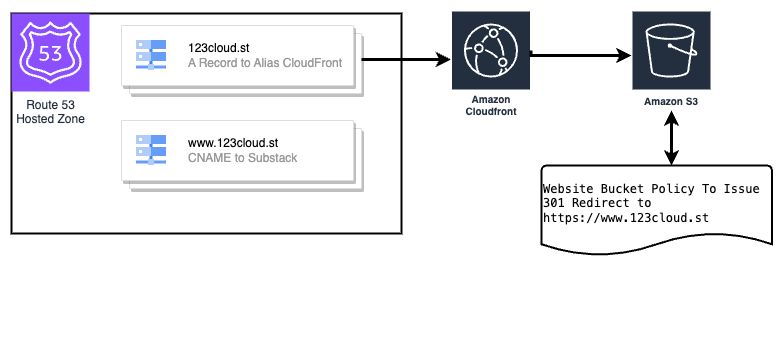

# Domain Redirection via S3 and CloudFront

This AWS CloudFormation stack enables redirection from a specified source domain to a destination domain using an S3 bucket and a CloudFront distribution. It can optionally create DNS records in Amazon Route 53 and provision an ACM (AWS Certificate Manager) certificate if needed.

## Overview

This stack creates resources necessary for HTTP to HTTPS redirection using an Amazon S3 bucket to host the redirect logic and an Amazon CloudFront distribution to enforce HTTPS and cache the redirect response globally. Additionally, if you opt to create DNS records or an ACM certificate, this stack will manage those resources within AWS Route 53 and AWS Certificate Manager, respectively.

## Architecture Diagram

## Template Details

- **Source Domain**: The domain from which traffic will be redirected.
- **Destination Domain**: The target domain to which traffic will be redirected.
- **Amazon S3 Bucket**: Configured for website hosting and handles the redirection.
- **Amazon CloudFront**: Serves the redirect with low latency and high transfer speeds globally.
- **Amazon Route 53**: Manages DNS records (optional).
- **AWS Certificate Manager**: Manages SSL/TLS certificates for secure requests (optional).

## Parameters

When launching this stack, you will be asked to provide several parameters:

- `SourceDomain`: The domain name that users will initially access.
- `DestinationDomain`: The domain name to which users will be redirected.
- `HostedZoneId`: The ID of the hosted zone containing the DNS records for the source domain.
- `CreateDNSRecords`: Specifies whether you want to create DNS records in Route 53 (`yes` or `no`).
- `ACMCertificateArn`: The ARN of an existing ACM certificate. If not provided, one may be created.
- `CreateACMCertificate`: Specifies whether to create a new ACM certificate if one is not provided (`yes` or `no`).

## Usage

1. Log into the AWS Management Console and navigate to the AWS CloudFormation service.
2. Choose 'Create Stack' and opt to upload a template file or provide the template URL.
3. Fill in the required parameters, such as the source and destination domains.
4. Review your settings and create the stack.
5. Once the stack creation is complete, the source domain will redirect to the destination domain.

## Outputs

The template will output the following upon successful deployment:

- `S3BucketName`: The name of the S3 bucket used for the redirect.
- `CloudFrontDistributionDomainName`: The domain name of the CloudFront distribution.

## Considerations

- If you're creating a new ACM certificate, you need to validate it by adding a CNAME record to the DNS configuration for your domain. The stack outputs will provide you with the details for validation.
- DNS record creation will only work if the specified `HostedZoneId` corresponds to a hosted zone managed in Amazon Route 53.
- This requires the use of a PUBLIC S3 bucket. If you want to use a PRIVATE S3 bucket, you will need to use a Lambda@Edge function to handle the redirect logic. See [this blog post]() for more information.

## Contact

For questions or issues, feel free to open an issue on the repository or submit a pull request with your suggested changes.