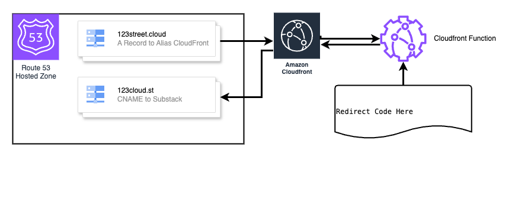

# CloudFront Function 301 Redirect with HTTPS

This CloudFormation template automates the process of redirecting requests from a root domain (e.g., `example.com`) to a subdomain (e.g., `www.example.com`) or from one domain(e.g., `123street.cloud`) to another (e.g., `123cloud.st`) using AWS CloudFront Functions, Amazon Route 53, and an AWS Certificate Manager (ACM) Certificate for SSL/TLS certificates.

## Architecture Diagram

## Description

The CloudFormation stack deploys a streamlined architecture to redirect queries from a root domain to a desired subdomain. This is particularly useful for directing main site traffic to a blog or other specialized services. The redirection is facilitated globally with minimal latency using Amazon CloudFront.

## Features

- **Serverless Redirection**: Employs CloudFront Functions to handle redirection without needing a server setup.
- **Global Reach**: Ensures low-latency redirects worldwide through the Amazon CloudFront CDN.
- **Secured Redirection**: Supports HTTPS through ACM, enhancing security during transfers.
- **DNS Management**: Includes an option to manage DNS records in Amazon Route 53 for the root domain.

## Components

- **AWS CloudFront Functions**: Checks incoming requests and redirects them to the specified subdomain.
- **Amazon CloudFront**: Serves as the content delivery network to dispatch the redirections efficiently.
- **Amazon Route 53**: Manages DNS setups, ensuring queries to the root domain are pointed to the correct CDN.
- **AWS Certificate Manager (ACM)**: (Optional) Manages SSL/TLS certificates to secure redirections.

## Prerequisites

- Domain ownership with DNS managed via Amazon Route 53.
- An ACM certificate in the `us-east-1` region if setting up HTTPS redirection. One will be created if not provided.

## Parameters

- `SourceDomain`: Your root domain, e.g., `123street.cloud`.
- `DestinationDomain`: Your target domain, e.g., `123cloud.st`.
- `HostedZoneId`: The Route 53 hosted zone ID for your root domain.
- `CreateDNSRecords`: Choose whether to auto-generate Route 53 DNS records (yes/no).
- `ACMCertificateArn`: ARN of an existing ACM certificate, if available.
- `CreateACMCertificate`: Whether to create a new ACM certificate if none is provided (yes/no).

## Deployment

1. Access the AWS Management Console.
2. Navigate to CloudFormation and initiate a new stack creation.
3. Upload or input the template.
4. Enter the required parameters as prompted.
5. Deploy the stack.

Post-deployment, any access to the root domain will be redirected to the designated domain or subdomain using HTTPS if configured.

## Maintenance and Contributions

Adjustments to the redirection or configurations can be done by modifying the CloudFront Function within the stack and updating the deployment. Contributions to the template via GitHub forks and pull requests are encouraged.

## Support and Issues

For support or issue reporting, open an issue on the GitHub repository page.

## Licensing

Released under the MIT License. See the repository's LICENSE file for details.
