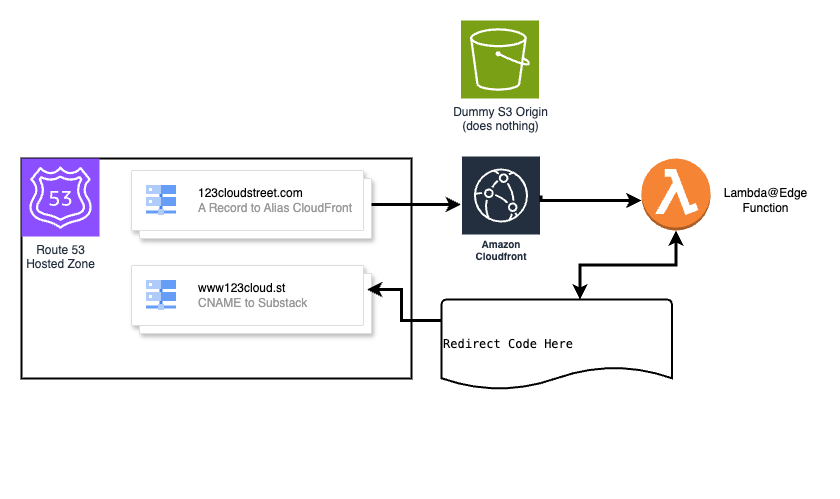

# AWS Root Domain to Subdomain Redirect using Lambda@Edge

This CloudFormation stack is designed to redirect traffic from a root domain (e.g., `example.com`) to a subdomain (e.g., `www.example.com`) using AWS services including CloudFront, Route 53, and Lambda@Edge.

## Description

This stack sets up all necessary resources to perform a URL redirect from your root domain to your subdomain leveraging CloudFront's distribution system, Route 53 for domain name system management, and Lambda@Edge for customizing the behavior of CloudFront.

This solution is particularly useful for those using platforms like Substack to host their blog, which require a subdomain. This stack allows you to redirect users from your root domain to your blog hosted on a subdomain.

## Architecture Diagram

## Key Components

- **AWS CloudFront**: CDN service to serve the redirect globally with low latency.
- **Amazon Route 53**: DNS web service for directing traffic to the CloudFront distribution.
- **ACM Certificate**: AWS Certificate Manager (ACM) to handle SSL/TLS certificates for secure HTTPS redirection.
- **AWS Lambda@Edge**: Runs on CloudFront's edge locations, checks the host header of incoming requests, and returns a 301 redirect if necessary.

## Prerequisites

- You must own a domain and its respective hosted zone should be registered in Amazon Route 53.
- You wish to redirect the root domain to a website hosted on a subdomain of your root domain. For example, you want to redirect `example.com` to `www.example.com`.
- ACM Certificate must be in the `us-east-1` region. This is a limitation of CloudFront - it's easiest to deploy the stack in the `us-east-1` region to avoid any issues.

## Parameters

When launching the stack, you will be prompted to specify the following parameters:

- `SourceDomain`: The domain name that users will initially access (e.g., `example.com`).
- `DestinationDomain`: The domain name to which users will be redirected (e.g., `www.example.com`).
- `HostedZoneId`: The ID of the hosted zone containing the DNS records for the source domain.
- `CreateDNSRecords`: Specifies whether you want to create DNS records in Route 53 (yes or no).
- `ACMCertificateArn`: The ARN of an existing ACM certificate. If not provided, one may be created.
- `CreateACMCertificate`: Specifies whether to create a new ACM certificate if one is not provided (yes or no).

## Usage

To deploy this CloudFormation stack:

1. Log into your AWS Management Console.
2. Go to the AWS CloudFormation service.
3. Choose 'Create stack' > 'With new resources (standard)'.
4. Upload or paste this stack template.
5. Fill out the Parameters form when prompted.
6. Review and create the stack.

Once the stack is deployed, it will automatically redirect all traffic from your root domain to the defined subdomain using HTTPS.

## Additional Resources

- [AWS CloudFront](https://aws.amazon.com/cloudfront/)
- [Amazon Route 53](https://aws.amazon.com/route53/)
- [AWS Certificate Manager](https://aws.amazon.com/certificate-manager/)
- [AWS Lambda@Edge](https://aws.amazon.com/lambda/edge/)

## Support

For questions or issues, feel free to open an issue on the repository or submit a pull request with your suggested changes.