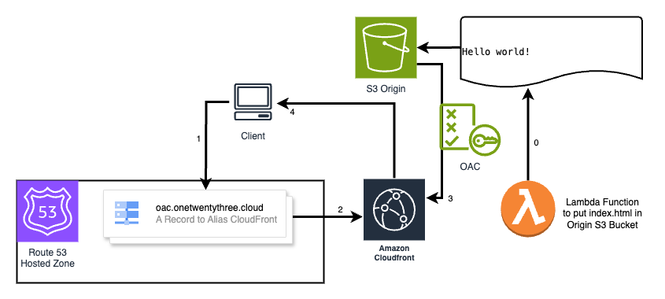

# Secure S3 Content Delivery with CloudFront and CORS Configuration (OAC)

This comprehensive CloudFormation template assembles a secure content delivery architecture using Amazon S3, Amazon CloudFront, AWS Lambda, and proper Cross-Origin Resource Sharing (CORS) settings for your web assets. Ideal for serving static content with enhanced security and global performance, this setup is pivotal for applications requiring stringent privacy coupled with swift, global access.

## Architecture Diagram



## Description

Deploy a secure, private Amazon S3 bucket for your static content, distributed globally through Amazon CloudFront for minimized latency. Enhance operational efficiency and automation with AWS Lambda, and seamlessly manage cross-origin access through precisely configured CORS settings on S3. This solution is perfect for securely hosting and distributing web applications or any static content, ensuring both privacy and high availability.

## Key Features

- **S3 Bucket Privacy & CORS**: Implements S3 to store content securely, configuring CORS to support web applications from specified origins.
- **Global Content Delivery**: Leverages CloudFront for efficient content distribution across the world, ensuring low latency.
- **Lambda Automation**: Utilizes AWS Lambda to deploy the index.html file to the bucket, including pre-deletion cleanup tasks.
- **Comprehensive DNS & HTTPS**: Integrates Amazon Route 53 for DNS management and employs AWS Certificate Manager for HTTPS, ensuring encrypted traffic.

## Architecture Overview

Incorporating key AWS services, the architecture ensures secure and efficient content delivery:
- **Amazon S3**: Stores web content securely, configured with CORS for controlled cross-origin requests.
- **Amazon CloudFront**: Delivers the content globally with high transfer speeds, directly integrated with S3.
- **AWS Lambda**: Executes operational logic, like cleaning up the S3 bucket content upon deletion requests.
- **Amazon Route 53 & ACM**: Manages DNS entries for seamless domain integration and automates SSL/TLS certificate provisioning for secure connections.

## Prerequisites

- A domain with DNS management via Amazon Route 53.
- Define CORS policies based on your application's need for cross-origin access to the S3 content.

## Deployment Steps

1. **Access AWS CloudFormation**: Log into the AWS Console and select the CloudFormation service.
2. **Launch New Stack**: Initiate the creation of a new stack by inputting this CloudFormation template.
3. **Configure Parameters**: Provide details like your domain name, S3 bucket name, and hosted zone ID for Route 53.
4. **Deploy**: Confirm your configurations and deploy the stack. Progress can be tracked within the CloudFormation interface.

Post-deployment, your infrastructure is ready, with cross-origin access aligned with your specified CORS policies.

## CORS Configuration Details

The S3 bucket’s CORS policy is crucial for web applications that request resources from a different domain than the one serving the application. This template configures the S3 bucket with CORS to allow specific HTTP headers, HTTP methods, and origins, ensuring your application's seamless operation.

Example CORS Configuration:

```yaml
CorsConfiguration:
  CorsRules:
    - AllowedHeaders: ['*']
      AllowedMethods: ['GET']
      AllowedOrigins: [ !Sub "https://${DomainName}" ]
      ExposedHeaders: ['Date']
      MaxAge: 3600
```

## Maintenance, Contributions & Support

- For adjustments, directly update the CloudFormation stack for redeployment.
- Contributions or suggestions are welcome through pull requests on the repository.
- Reach out via GitHub issues for support or queries.

## License

The project is shared under the MIT License. Refer to the LICENSE file in the repository.
