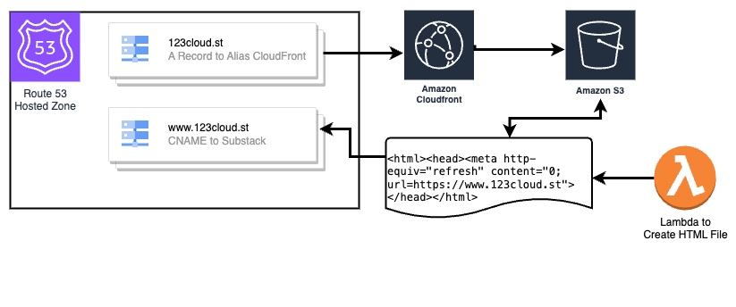

# AWS Root Domain to WWW Redirect

This CloudFormation stack is designed to redirect traffic from a root domain (e.g., `123cloud.st`) to any subdomain (e.g., `www.123cloud.st`) using AWS services including CloudFront, Route 53, an S3 bucket, an ACM Certificate, and an AWS Lambda function.

## Description

This stack sets up all necessary resources to perform a URL redirect from your root domain to your subdomain leveraging CloudFront's distribution system, an S3 bucket configured for web hosting, and Route 53 for domain name system management.

This is very useful for those using Substack to host their blog and want to redirect their root domain to their Substack blog. Substack does not support root domains, so this is a workaround to redirect users to your blog hosted on a subdomain.

## Architecture Diagram

## Key Components

- **Amazon S3 Bucket**: Used to host a static redirect page.
- **AWS CloudFront**: CDN service to serve the redirect globally with low latency.
- **Amazon Route 53**: DNS web service for directing traffic to the CloudFront distribution.
- **ACM Certificate**: AWS Certificate Manager (ACM) to handle SSL/TLS certificates for secure HTTPS redirection.
- **AWS Lambda**: Runs once - a minimal code snippet to upload the static HTML redirect page to the S3 bucket upon stack creation.

## Prerequisites

- You must own a domain and its respective hosted zone should be registered in Amazon Route 53.
- You wish to redirect the root domain to a website hosted on a subdomain of your root domain. For example, you want to redirect `123cloud.st` to `www.123cloud.st`.
- ACM Certificate must be in the `us-east-1` region. This is a limitation of CloudFront - its easiest to deploy the stack in the `us-east-1` region to avoid any issues.

## Parameters

When launching the stack, you will be prompted to specify the following parameters:

- `RootDomainName`: The root domain name (e.g., `123cloud.st`).
- `WWWDomainName`: The domain endpoint where you want users directed (e.g., `www.123cloud.st`).
- `HostedZoneID`: The ID of the hosted zone in Route 53 associated with your domain.

## Usage

To deploy this CloudFormation stack:

1. Log into your AWS Management Console.
2. Go to the AWS CloudFormation service.
3. Choose 'Create stack' > 'With new resources (standard)'.
4. Upload or paste this stack template.
5. Fill out the Parameters form when prompted.
6. Review and create the stack.

Once the stack is deployed, it will automatically redirect all traffic from your root domain to the defined subdomain using HTTPS.

## Outputs

- `CloudFrontDistributionDomainName`: The domain name of the CloudFront distribution that handles the redirects.
- `RedirectAcmCertificateArn`: The ARN of the ACM certificate used by CloudFront.

## Additional Resources

- [Amazon S3](https://aws.amazon.com/s3/)
- [AWS CloudFront](https://aws.amazon.com/cloudfront/)
- [Amazon Route 53](https://aws.amazon.com/route53/)
- [AWS Certificate Manager](https://aws.amazon.com/certificate-manager/)
- [AWS Lambda](https://aws.amazon.com/lambda/)

## Support

For questions or issues, feel free to open an issue on the repository or submit a pull request with your suggested changes.
